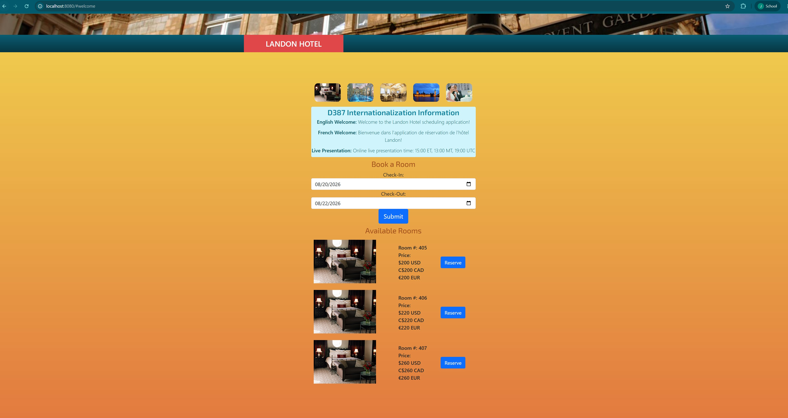

# Landon Hotel Booking System

A Dockerized hotel reservation application built with Java, Spring Boot, Angular, multithreading, internationalization, currency display, and time-zone conversion.

This project was completed as part of Western Governors University’s **Advanced Java (D387)** course. The original Landon Hotel starter application was extended to support multilingual welcome messages, multi-currency reservation pricing, time-zone conversion, and Docker containerization.

## Application Preview



---

## Project Overview

The application provides a hotel reservation interface with a Java Spring Boot back end and an Angular front end.

The project demonstrates:

- Full-stack application development
- Java multithreading
- Internationalization and localization
- Angular front-end development
- RESTful API integration
- Time-zone conversion
- Multi-currency price display
- Docker image creation and containerization

---

## Features

### Multilingual Welcome Messages

The application uses Java resource bundles to provide welcome messages in:

- English
- Canadian French

Each language message is loaded and displayed using a separate Java thread.

### Currency Display

Reservation prices are displayed in:

- U.S. dollars
- Canadian dollars
- Euros

The values are shown on separate lines in the Angular interface.

### Time-Zone Conversion

The application converts and displays an online presentation time in:

- Eastern Time
- Mountain Time
- Coordinated Universal Time

### Docker Support

The project includes a Dockerfile that packages the Spring Boot application into a container image.

---

## Technologies Used

### Back End

- Java 17
- Spring Boot
- Spring Data JPA
- Maven
- REST APIs

### Front End

- Angular
- TypeScript
- HTML
- CSS

### DevOps

- Docker
- Git
- GitHub
- GitLab

### Additional Concepts

- Java resource bundles
- Internationalization
- Localization
- Multithreading
- Time-zone conversion

---

## Project Structure

```text
src/
├── main/
│   ├── java/
│   │   └── edu.wgu.d387_sample_code/
│   ├── resources/
│   │   ├── welcome_en_US.properties
│   │   └── welcome_fr_CA.properties
│   └── UI/
│       └── Angular application
├── Dockerfile
└── pom.xml
```

---

## Running the Application Locally

### Prerequisites

- Java 17
- Node.js
- npm
- Maven
- Docker

### Build the Spring Boot Application

```bash
./mvnw clean package
```

On Windows:

```powershell
.\mvnw.cmd clean package
```

### Run the Back End

```bash
java -jar target/D387_sample_code-0.0.2-SNAPSHOT.jar
```

### Run the Angular Front End

Navigate to the Angular UI directory:

```bash
cd src/main/UI
```

Install dependencies:

```bash
npm install
```

Start the Angular development server:

```bash
npm start
```

---

## Docker

Build the Docker image:

```bash
docker build -t landon-hotel-booking-system .
```

Run the container:

```bash
docker run --name landon-hotel-app -p 8080:8080 landon-hotel-booking-system
```

The application back end will be available at:

```text
http://localhost:8080
```

---

## Cloud Deployment Approach

The Dockerized application could be deployed using Amazon Web Services.

A practical deployment architecture would include:

- Amazon Elastic Container Registry for storing the Docker image
- Amazon Elastic Container Service or AWS App Runner for running the container
- Amazon RDS for a managed relational database
- Amazon CloudWatch for logs and monitoring
- Application Load Balancer for traffic distribution
- AWS Certificate Manager for HTTPS certificates

---

## Project Status

This repository is maintained as a completed academic portfolio project and is no longer under active development.

It demonstrates my experience with Java, Spring Boot, Angular, Docker, localization, multithreading, and cloud deployment planning.

---

## Attribution

The original Landon Hotel starter application was provided as part of Western Governors University’s Advanced Java course.

The multilingual resource bundles, threaded message display, currency presentation, time-zone conversion, Docker configuration, and deployment design were implemented as part of the course assessment.

---

## License

This repository is intended for educational and portfolio purposes.
